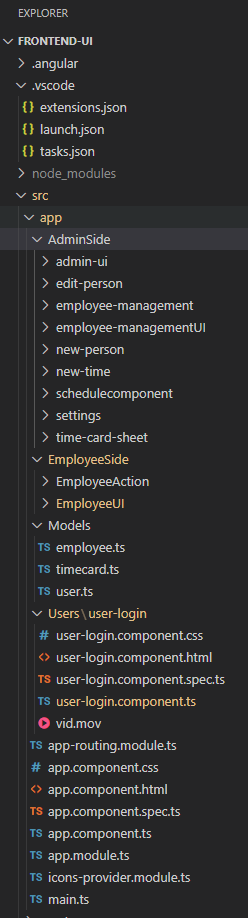

# WorkxTimeAndAttendance

## Welcome to my Senior Capstone ReadMe File. 

### Link to Portfolio Website where you can download and see more about this project and my other ventures!

### Project Introduction : Problem we are trying to solve
At Work Time And Attendance our team strives to achieve one
simple goal, provide the best product while ensuring the highest quality service. For
companies that are looking to stay up to date with the latest technologies or have simply
outgrown their current HR infrastructure, Workx is here to help. Managing the employee
experience is something our team values and believes if there is a centralized place for
them to punch into work and view their schedules less time will be wasted. Through this
software, executives will have administrative accounts with access to a dashboard to
conduct their tasks in an aesthetically pleasing platform. The dashboard will be used to
perform a range of operations to make sure the employees are organized and have a
successful experience. Avoiding unforced errors made by outdated or overly complex
technology is something we aim to push our partners away from

## High Level Functional and Nonfunctional Requirements that this project meets

### Nonfunctional Requirements:
- Load speed for all web pages should be booted up under 7 seconds.
- All pages should be reliable and if crashes be given proper handling to a live web
page.
- Responsive website design. This application should be able to be rendered in a
variety of different screen sizes.
- Usability, the site will not crash instantly upon boot ever once deployed.
- Functional Requirements:
- Employees will have the ability to login with unique credentials.
- Employees will be able to clock in and clock out.
- Employees will be able to see their schedules
- Admin will be able to Create, Read, Update, Delete Employees.
- Admin will be able to Create, Read Update, Delete TimeCard punches.
- Admin will be able to Create, Read, Update, Delete, Schedules
- Admin will have access to a setting page.
- Admin will be directed to the EmployeeUI page once login first

## Technologies Chosen: Industry Best Practices : Cloud Deployment : Dev Ops Principles

- Database: MongoDB, This database was chosen because I wanted to build an enterprise
application that was not sql based. Since the industry is moving towards this direction, I
felt confident that this would be a great experience based on the content I viewed on their
main documentation site.

- Front End : Angular-JS, This framework was chosen because it leveraged the MVC
architecture. Frameworks that support the MVC architecture is something I felt really
comfortable with prior to this capstone. Knowing this and the rise of popularity Angular
has in the software development realm made this a great choice. Additionally, the amount
of support this has with my chosen backend framework made it an extremely stable
framework.

- Back End : Java - Spring Boot, Spring Boot was chosen because of its simplicity as a
framework. Spring Boot when researched was a very stable framework that was
extremely intriguing when I first was introduced to it. Compared to other frameworks I
saw with Java, Spring Boot also worked great with a variety of Front End Frameworks
like Angular making this a great choice.

- Cloud Deployment: This application was deployed to the cloud in Azure and is currently
set up with a build pipeline within the platform.

- DevOps Principles: . The DevOps principles that were applied in this process were
understanding the flow of work, not passing defects downstream, and testing my code
before deployments properly. Being mindful of potential log file issues and print lines in
critical health portions of the app was something I was extremely mindful of.

## New technologies learned : Why there were chosen
Database: MongoDB was used simply to gain more knowledge about NoSql databases!
In 2021 when doing research for this project, I had gotten the opportunity to take a
database design class. It was through this class that I was inspired by the opportunities
that could be leveraged and simply got to work!

- FrontEnd: AngularJS: I chose Angular as the front end framework for my project
because I wanted to leverage an MVC framework and leverage 3rd party libraries. This
was an extremely fun challenge because it made me think out of the box and learn more
about front end frameworks as a wholeIndustry best practices that are supported in my
Design and implementation are the custom exception handling, and having my code
properly respect the model view controller framework. All code from the backend to
front end is javadoc compliant to industry standard. There was a period of time where this
application leveraged thymeleaf as it’s front end, due to structuring my code properly It
was a very easy transition to add Angular!
-
- BackEnd: SpringBoot: Spring Boot as a framework was very lucrative because of the
popularity it was gaining and the simplicity it provided to programmers. After several test
case applications and learning more about how to leverage an entity style framework was
very fun and led me to choose this technology.

## Technical Approach Taken : Diagrams

Technical Approach: I started by designing what I wanted my web application to look
like and worked backwards from there. I removed functionality along the way and was
able to understand at a high-level what data types would be needed. I met with my
mentor Professor Mark Reha multiple times throughout this process to make sure my
designs were practical. In one of our brainstorming sessions, we talked about how data
was going to be passed and the requirements that would need to be met. We also talked
about specific libraries that would need to be used for this project and he assisted me on
my understanding of using APIs in a full stack environment

## Risks : Challenges

- Risks: Some of the risks that I encountered switching to Angular was managing my time
to learn a new framework. Understanding typescript was quite a challenge at first,
however after continuous practice I was able to gain a general understanding and move
forward. Another risk I faced was leveraging a free version of MongoDB and not a paid
version. This led to my database canceling out every several weeks during development.
For the future, using a paid version of MongoDB would solve that issue.

- Challenges: Some of the challenges I have faced with the project were understanding
how to write the most efficient code from an algorithms and datastructures standpoint. I
consistently had to revamp back end api endpoints to be more efficient which slowed
down the time of development. The risk management approaches I took were leveraging
my mentor at all times. Throughout this development process I worked with my mentor
to ask numerous questions and seek guidance. This was really a great way to assess risk
and to stay on track with project goals.

### Project File Structure Angular

### Project File Structure Spring

## Outstanding Issues
- Outstanding issues : The issues are simple formatting data responses and saving the
calendar to the database. As of right now the calendar function is not saved to the
database simply hardcoded values.
