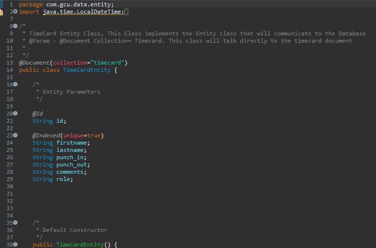
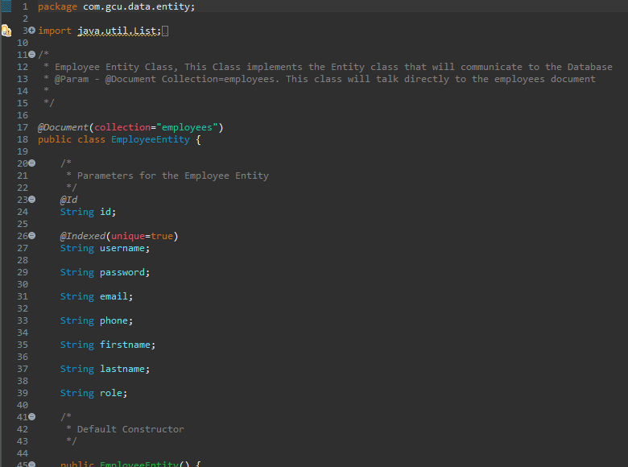

# WorkxTimeAndAttendance

## Welcome to my Senior Capstone ReadMe File. 
## In this document I will be talking about cool features I implemented and explaining the reasoning behind my documentation

### Link to Portfolio Website where you can download and see more about this project and my other ventures!

https://stefanossophocleous.herokuapp.com/

### For my Technology Stack I chose to work with 
#### MongoDB, Spring Boot, Angular JS

 I was able to map out the logical solutions and see the project in a different lense! I made adjustments to my project as needed. I display the connections and the libraries used in my application. AntZlibrary was a great resource to design the UI, and Kendo was used for the scheduler. I ended using 2 apis with over 14 endpoints!
 
 
 ### Here is the UML diagram. I was abled to map out the backend as clean as possible. However, for the front end I mapped AngularJS files by components
 
 

### If interested in my project structure! Here are a few snippets as well! 
### Back End (Spring Boot)

### Front End (Angular JS)

### Snippets from my TimeCard API Class

### Snippets from my Employee API Class

